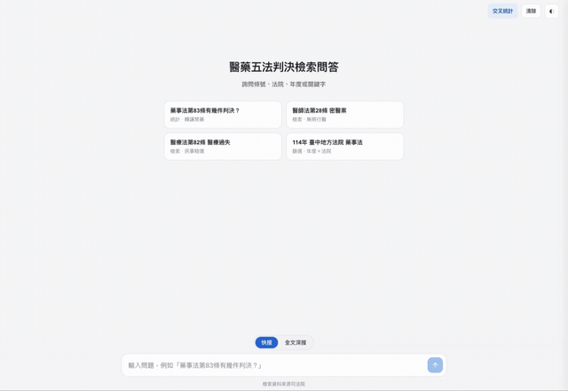

# medlaw-research

> **從零打造一套資訊檢索流程，理解 AI 問答真正的地基**

大多數 AI 問答，最吸引人的都是模型。

但真正決定答案品質的，往往不是模型，而是模型之前的那一層：**資料如何取得、如何整理、如何檢索，如何證明答案來自哪裡**

這個專案刻意把大型語言模型（LLM）拿掉，從最底層開始，親手完成一套能夠**檢索、回答、引用原文**的對話式系統，在完全不依賴 AI 的情況下，究竟能做到哪一步

<p align="center">
  
</p>

---

# 專案目標

疑問：

> **當 AI 回答問題並附上引用來源時，真正完成這件事的，到底是模型，還是模型之外的系統？**

因此，我沒有從模型開始，而是選擇重建它下面的整條資料處理流程：

- 如何取得資料
- 如何解析非結構化內容
- 如何建立全文索引
- 如何理解使用者查詢
- 如何找到最相關的文件
- 如何保證每一個答案都能回到原文

完成之後才發現，整個流程幾乎都與 AI 無關，而是經典的 **Information Retrieval（資訊檢索）** 與 **Data Engineering（資料工程）**。

---

# 系統流程

```text
                  Court Judgments
                        │
                        ▼
                Stateful Web Crawler
                        │
                        ▼
                  HTML Parser
                        │
                        ▼
              Structured JSON Dataset
                        │
                        ▼
          Chinese Character n-gram Index
                        │
                        ▼
                Inverted Index Builder
                        │
                        ▼
                 Query Understanding
           (article / court / keyword ...)
                        │
                        ▼
                 Document Ranking
                        │
                        ▼
          Highlight + Source Citation
```

流程完全採用傳統資訊檢索技術，不依賴大型語言模型

---

# 為什麼選擇裁判書？

我需要一份足夠真實，而且足夠麻煩的資料。

裁判書查詢系統正好符合。

它不是一份整理好的資料集，而是一個典型的舊式 ASP.NET 網站：

- Stateful Session
- 查詢結果最多 500 筆
- 全文只有 HTML
- 幾乎沒有可直接利用的結構
- 案件數量呈長尾分布

正因為它不好處理，才更接近真實世界。

如果一開始就使用乾淨的資料集，很多工程問題根本不會出現。

---

# 過程中完成了哪些事情？

整套資訊檢索流程從零開始建立。

## 1. 突破查詢限制

裁判書每次查詢最多只能取得 500 筆資料。

因此改採：

- 日期區間遞迴二分
- 每個區間控制在 500 筆以下
- 最後重新合併結果

完成完整資料下載。

---

## 2. HTML 結構化

從大量 HTML 中解析出：

- 案號
- 法院
- 判決日期
- 案由
- 全文
- 各種結構欄位

轉成 JSON Dataset。

---

## 3. 中文全文檢索

中文沒有天然詞界。

因此沒有直接使用英文常見的 Tokenizer，而是建立：

- Character n-gram
- 倒排索引（Inverted Index）
- TF 排序
- 命中高亮

完成全文搜尋能力。

---

## 4. Query Parsing

將自然輸入：

> 醫師法28條 台北高院 緩刑

拆解成：

- 法條
- 法院
- 關鍵字
- 其他篩選條件

最後組合成真正的搜尋查詢。

---

## 5. Citation

每一筆搜尋結果都可以：

- 回到原始裁判書
- 查看完整全文
- 檢視命中位置

整個流程保持可追溯（Traceable）。

---

# 最大的收穫

原本以為，中途一定會遇到某個一定要用 AI 的地方

結果沒有

真正完成整個系統所需要的，是：

- HTTP
- Session
- HTML Parsing
- String Processing
- Data Structure
- Inverted Index
- Ranking

而不是大型語言模型

完成之後，我重新理解了一件事：

> **決定 AI 問答品質的，往往不是模型。**

模型固然重要，但它很難補救前面的問題。

如果：

- 資料品質不好
- 檢索找錯文件
- 引用來源錯誤

即使換成再強的模型，也無法真正改善答案品質。

真正決定系統品質的，是 Retrieval Pipeline。

---

# 這是可以重複利用的框架

整套 Pipeline

只要更換資料來源，例如：

- 企業內部文件
- 法規
- 技術文件
- API 文件
- 學術論文
- 客服知識庫

幾乎不用修改

判決資料只是驗證這套 Pipeline 的載體

真正完成的，是一副可以重複利用的 Retrieval 骨架

---

# AI 應該放在哪裡？

到這個階段，我反而更清楚 AI 最適合加入的位置

不是最前面，而是最後

例如：

- 使用 LLM 擷取更完整的結構欄位
- 自動產生判決摘要
- Embedding 補足語意搜尋
- Retrieval-Augmented Generation（RAG）
- 自然語言回答

這些都建立在 Retrieval 已完成之後

也因此，LLM 是一層能力，而不是整個系統

---

# 現在可以做到什麼？

- **快速搜尋**  
  條號、法院、案由、判決結果等結構化查詢。

- **全文搜尋**  
  任意字詞全文檢索、命中高亮、側欄閱讀。

- **交叉分析**  
  法院 × 年度 × 類別互動熱力圖。

整個搜尋流程皆在瀏覽器完成

不需呼叫 LLM

每筆結果皆可回溯原始裁判書

---

# 專案結構

```text
medlaw-research/
├── README.md
├── crosstab.html
├── medlaw-qa/
├── pipeline/
├── data/
└── docs/
```

---

# 延伸文件

- `docs/NOTES.md`  
  學習筆記、倒排索引、中文全文檢索。

- `medlaw-qa/README.md`  
  問答系統架構。

- `pipeline/README.md`  
  爬取、解析、索引流程。

- `docs/USAGE.md`  
  部署與使用方式。

---

# 技術重點

- Python（建置期：爬取 / 解析 / 建索引）
- JavaScript（執行期：檢索 / UI）
- HTML Parsing
- Stateful Web Crawling
- Information Retrieval
- Character n-gram
- Inverted Index
- TF Ranking
- Query Parsing
- Source Citation
- Offline Search

---

# 練習語料

語料取自司法院公開裁判書查詢系統。

- 醫藥五法
- 民國112–115年（115年至7月）
- 去重後 14,031 筆
- 快照：2026-07-07

每筆搜尋結果均可回到原始裁判書。

由規則解析所得欄位（條號、刑度、法官等）可能存在少量誤差。

本專案僅供資訊檢索與工程研究用途，不構成法律意見，引用時仍應以原文為準。
